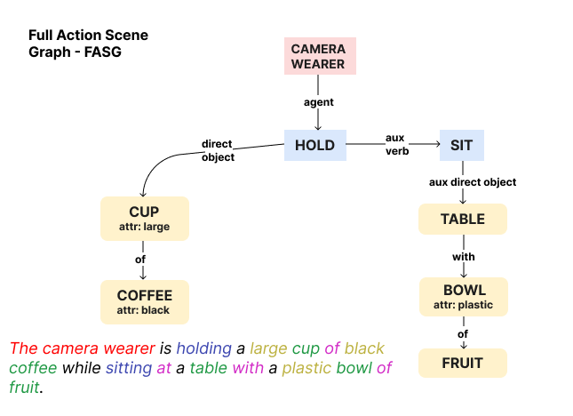
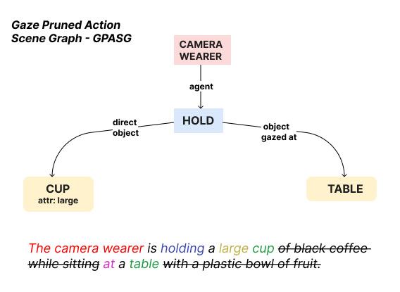
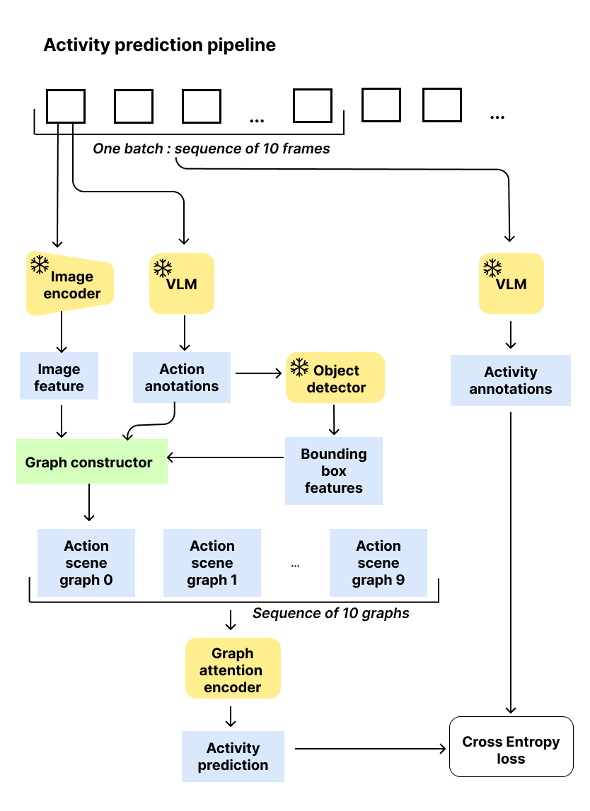
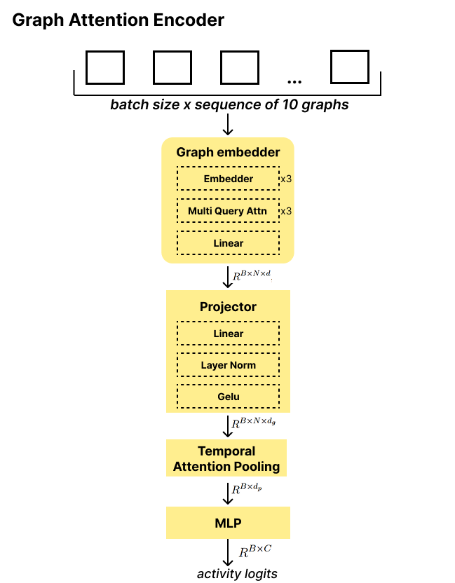
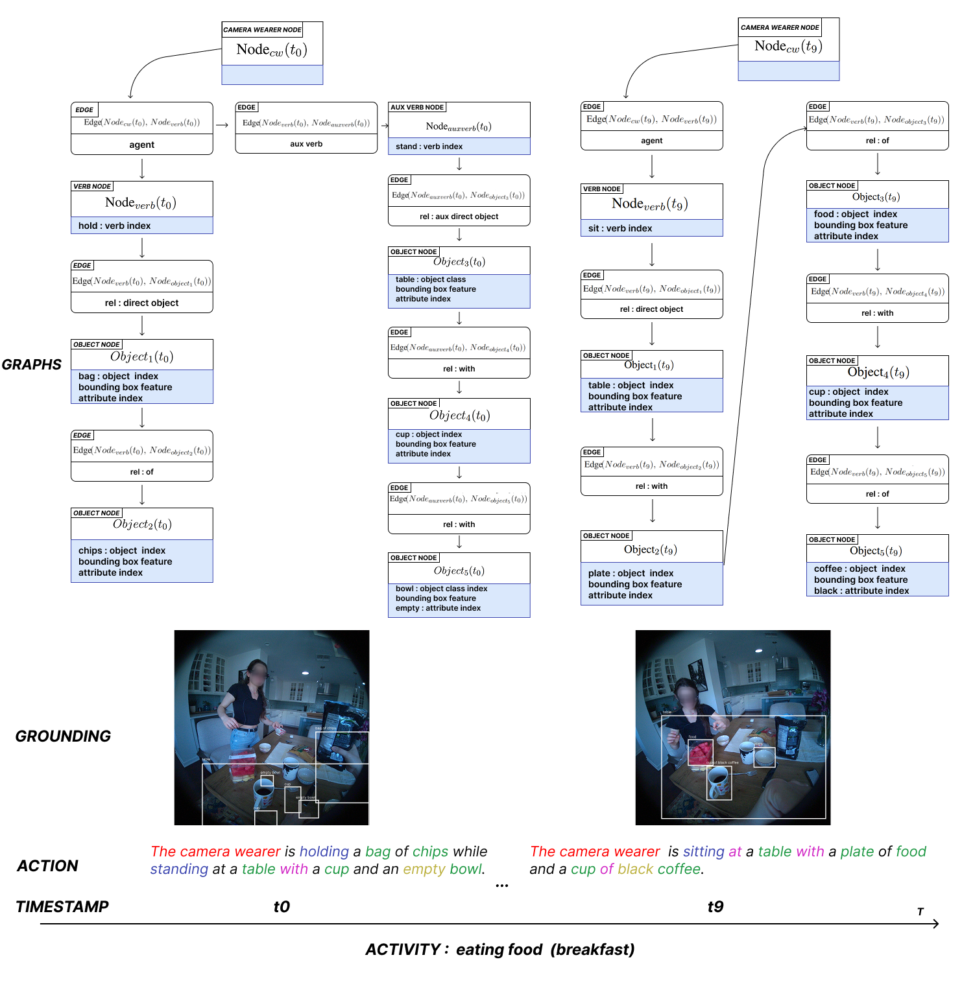

# Graph-Based Framework for Activity Recognition in Egocentric Videos

[Article](https://github.com/MarkoHaralovic/egocentric_video_graph_framework_ar/blob/main/article/Graph_Framework_for_Activity_Recognition_in_Egocentric_Videos.pdf)

## Abstract
We propose a graph-based framework for activity recognition in egocentric videos, representing each frame as an **Action Scene Graph (ASG)** constructed from a VLM caption. We introduce two graph variants:

1. **Full Action Scene Graph (FASG):** nodes correspond to the main/auxiliary action verb, objects, and their attributes, while edges encode semantic relationships between them.
2. **Gaze-Pruned Action Scene Graph (GPASG):** a compact subgraph containing only the interacted object and the gazed-at object.

Our pruning strategy can be viewed as improving global communication in the graph by shortening the longest path between key entities.

## Results
Model performance comparison (mean ± std across three runs):

| Model | Accuracy | F1-score |
|------|----------|----------|
| Baseline - DINOv3-H/16+ | 0.620 ± 0.030 | 0.327 ± 0.017 |
| Baseline - Timesformer-K600 | 0.577 ± 0.023 | 0.450 ± 0.028 |
| Proposed (ours) - GPASG | 0.647 ± 0.040 | 0.400 ± 0.010 |
| **Proposed (ours) - FASG** | **0.677 ± 0.012** | **0.467 ± 0.031** |

## Visuals

### Figure 1: Full vs. Gaze-Pruned Action Scene Graph

  
  

- [Full action scene graph](figures/FullActionSceneGraph.pdf)
- [Gaze-pruned action scene graph](figures/PrunedActionSceneGraph.pdf)

Left: Full action scene graph constructed from a VLM caption. Right: Gaze-pruned action scene graph constructed from a VLM caption. Nodes in blue represent main and auxiliary action verbs, nodes in orange represent objects interacted with, the red node represents the camera wearer (the action taker), and relations between them are encoded via edges (e.g., direct object, prepositions, agent). Each object has 0 to N attributes describing it.

---

### Figure 2: Workflow overview

Workflow overview.

---

### Figure 3: Graph Attention Encoder

Visualization of our Graph Attention Module, consisting of a graph embedder, linear projection into a lower-dimensional space, and attention pooling over the temporal dimension.

---

### Figure 4: Graph batch representation

Graph batch representation. Each batch consists of \(N\) consecutive frames. Each frame is action-annotated and a graph is constructed based on that action caption. Objects are grounded using a DETR-style detector. The whole batch receives one activity annotation.
